##### Capstone Project by Sabrina Saleh | Talent Path | July 2021

# **Song Popularity Prediction: ML Classification**

### Project Summary
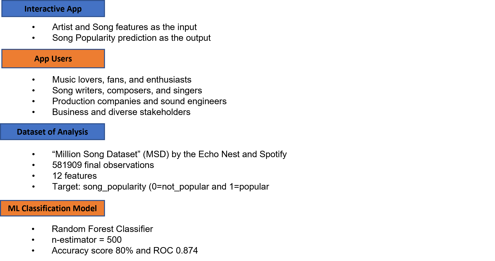

<!-- * The objective of this project is to build an **_interactive app_**, where the users can select a set of artist's features and song's features from the input option and as the outcome, the app will generate a song's popularity prediction based on the selected features. 
* The key users of this app are mostly from the **_music industry_**, which is forecasted to be a 61.82 billion dollar market globally and 22.61 billion dollar market in the United States for the year 2021.
* The project utilizes the “Million Song Dataset” (MSD); after the exploratory data analysis and data pre-processing, the final dataset contains a total of **_581909 observations_** with **_12 features_** and 1 target column **_(song_popularity where 1=popular and 0=not_popular)_**.   
* As the machine learning classification model, the **_Random Forest Classifier_** gives the best accuracy score of **_80%_** and ROC accuracy score of **_87.40%_**.     -->

### Introduction
Music is an integral part of our daily lives. Each year, thousands of music albums are released in the national and world markets. According to the Statista Research Report, the total revenue of the music industry is forecasted to be 61.82 billion dollar globally and 22.61 billion dollar in the United States for the year 2021. The objective of this capstone project is to build an interactive app, which the musicians, music lovers, sound engineers, and various other stakeholders can utilize in conducting songs' popularity prediction. The app will help the diverse stakeholders in learning about artists' (singers') features as well as songs' features that are critical for a song to be declared "popular" by the music industry. The powerful entities of the music industry such as Spotify, MusicBrainz, Echo Nest, and so forth have defined a set of artist's and song's feature-indices in the “Million Song Dataset” (MSD). In order to build the interactive app, I have conducted an extensive data analsis of the MSD feature-indices and incorporated them in developing a machine learning classification model for song's popularity prediction. In brief, the business questions of this project are as follows:

### Business Questions
* What are the artist's features and song's features that determine songs' popularity in the music industry?
* Which machine learning model can best simulate the artists' features and songs' features in predicting songs’ popularity with higher accuracy?  

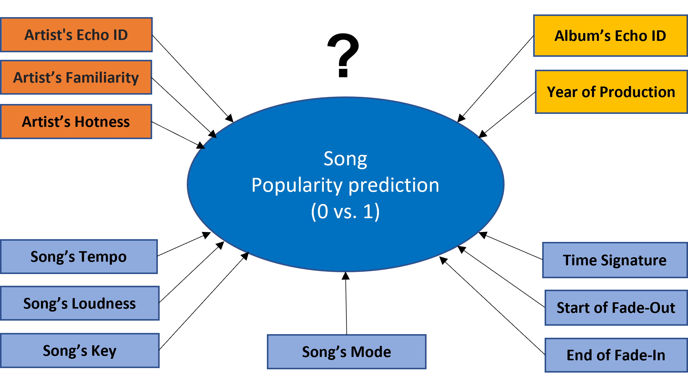

### Data Collection
The MSD dataset is a collection of metadata of a million contemporary music tracks from 1920 to 2010. It started as a collaborative project between the Echo Nest (now owned by Spotify) and LabROSA of Columbia University. The original dataset contains a total of 1 million observations of unique tracks with 53 feature columns and 1 target column (song_hotness). Important links for the MSD dataset are provided below:
* [Thierry Bertin-Mahieux, Daniel P.W. Ellis, Brian Whitman, and Paul Lamere. The Million Song Dataset. In Proceedings of the 12th International Society for Music Information Retrieval Conference (ISMIR 2011), 2011.](https://www.researchgate.net/publication/220723656_The_Million_Song_Dataset)
* [Million Song Dataset Official Website](http://millionsongdataset.com/)
* [Million Song Dataset HDF5 to CSV Converter, Alexis Greenstreet.](https://github.com/AGeoCoder/Million-Song-Dataset-HDF5-to-CSV) 

### Exploratory Data Analysis
Among the 53 feature of the original dataset, 20 features have been selected to initiate the exploratory data analysis. This selection is guided by the field experts with domain knowledge. The target variable, ‘song_hotness’ is measured on a scale from 0 to 1. This measure is transformed to a binary format, where the new column ‘song_popularity’ is defined by 0=not_popular and 1=popular. **_For the ‘song_hotness’ score below the mean 0.35605, zero (0) is assigned as 'not_popular' and for the ‘song_hotness’ score above the mean 0.35605, one (1) is assigned as 'popular'_**. 

#### Definition of Features & Target 
* track_id: Unique ID for each song
* song_title: Title of each song
* release_id: Unique ID for each release (108172)
* release: Title of each release/album
* year: Year when the song was released, according to musicbrainz.org
#### Artist Features
* artist_id: Unique ID for each artist (51751)
* artist_name: Name of each artist
* artist_familiarity: On a scale of 0 and 1, the familiarity index of the artist according to The Echo Nest 
* artist_hotness: On a scale of 0 and 1, the hotness index of the artist according to The Echo Nest
* artist_location: Location (countries/cities) of artist's origin 
#### Song Features
* duration: Duration of the track in seconds
* end_of_fade_in: End time of the fade in (in seconds), at the beginning of the song, according to The Echo Nest
* start_of_fade_out: Start time of the fade out (in seconds), at the end of the song, according to The Echo Nest 
* tempo: Tempo in BPM according to The Echo Nest
* loudness: General loudness of the track where the maximum decibels in mixing is represented as 0
* key: A key is the major or minor scale around which a song revolves; estimation of the key the song is in by The Echo Nest: 0, 1, 2, 3, 4, 5, 6, 7, 8, 9, 10, 11
* key_confidence: Confidence level of the key estimation
* mode: A mode is a type of musical scale coupled with a set of characteristic melodic and harmonic behaviors; estimation of the mode the song is in by The Echo Nest: 0, 1
* mode_confidence: Confidence level of the mode estimation
* time_signature: Usual number of beats per bar; time signature of the song according to The Echo Nest: 0, 1, 3, 4, 5, 7
* time_signature_confidence: Confidence level of the time signature estimation
#### Target Variable
* song_hotness: On a scale of 0 and 1, the hotness index of the song according to The Echo Nest 
* song_popularity: 0 = not_popular vs. 1 = popular

#### Missing Data Analysis
* artist_location: Drop the entire column due to 48.71% missing data
* song_hotness: Drop the rows with 41.80% missing data 

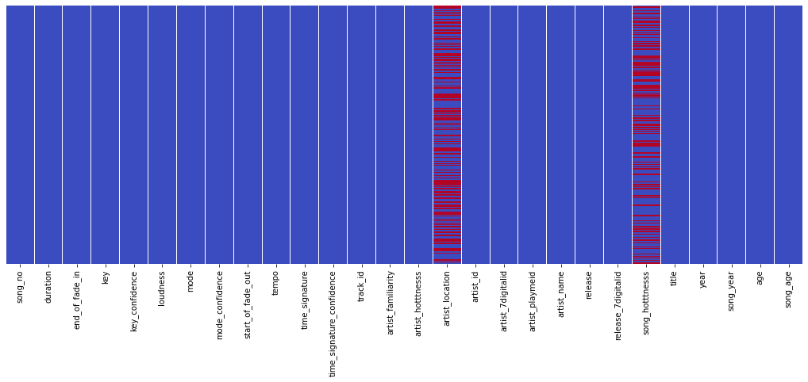

#### Target Variable (Pre_Binary Conversion): "song_hotness"
* On a scale of 0 and 1, the hotness index of the song according to The Echo Nest 
* Evidence of right skewed distribution due to mode at 0 

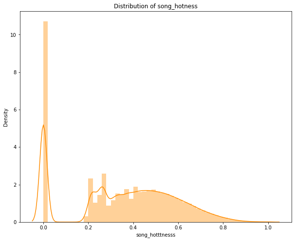

#### Target Variable (Post_Binary Conversion): "song_popularity"
* For the ‘song_hotness’ score below the mean 0.35605, song_popularity = 0 (not_popular)
* For the ‘song_hotness’ score above the mean 0.35605, song_popularity = 1 (popular)

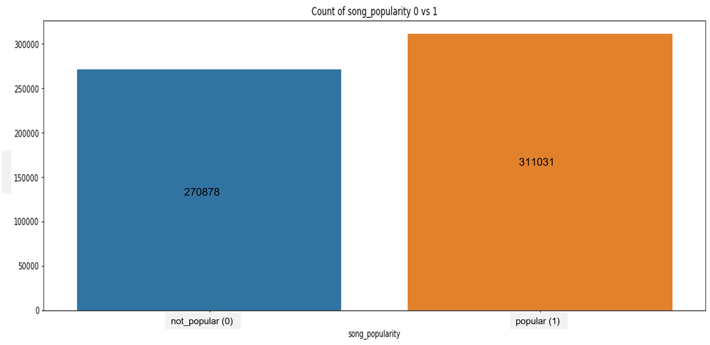

#### Outlier Treatment
* Machine learning model test with outlier and robust scaler
* Machine learning model test with outlier treatment and smaller dataset
* Model accuracy is significantly better for the analysis with outlier and robust scaler 

#### Correlation and Multicollinearity Test

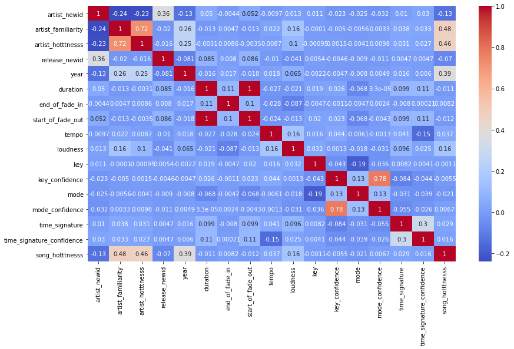

#### ML-Model Feature Importance Ranking

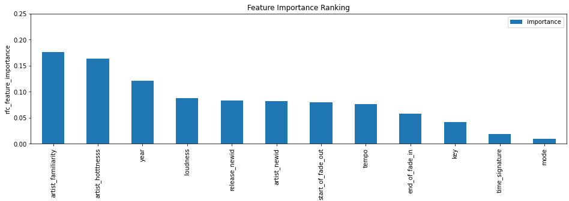

### Machine Learning Modeling (Classification)
* Categorical data conversion for "artist_newid" and "release_newid".
* Data scaling with robust scaler to address the presence of outliers.
* Train and Test data split with the test_size = 0.33.
* Classification model testing with logistic regression, decision tree, random forest, and random forest with grid search.
* Random Forest Classifier with n-estimators = 500 gives the best accuracy score of 80% and ROC accuracy score of 87.40%.

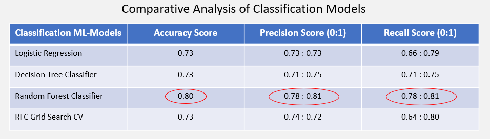

#### Classification Report of Random Forest Model
* In precision, the denominator is the "total negative prediction". True(-)/True(-)+False(-)
* In precision, the denominator is the "total positive prediction". True(+)/True(+)+False(+)
* In recall, the denominator is the "actual negative total". Recall = True(-)/True(-)+False(+)
* In recall, the denominator is the "actual positive total". Recall = True(+)/True(+)+False(-)
* Accuracy measures the ratio of correct prediction to total prediction
* Accuracy = True(+)+True(-)/True(+)+True(-)+False(+)+False(-) 

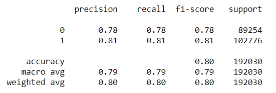

#### Confusion Matrix of Random Forest Model
* The confusion matrix indicates the presence of Type I error, where false positive predictions are 20065 out of 192030 test dataset. 
* The confusion matrix indicates the presence of Type II error, where false negative predictions are 19259 out of 192030 test dataset. 
* The normalized confusion matrix summarizes the precision percentages and the Type I and Type II error percentages.

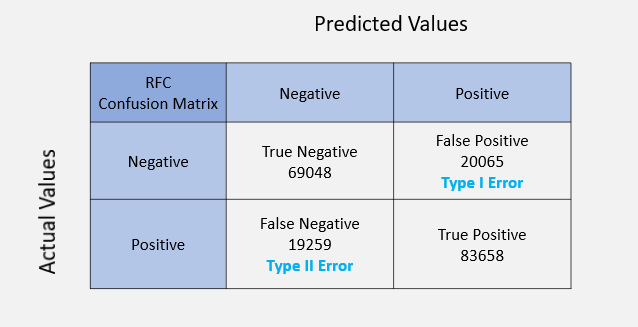

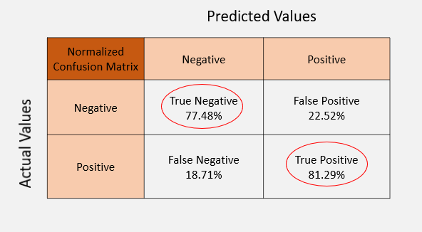

#### ROC Curve of Random Forest Model

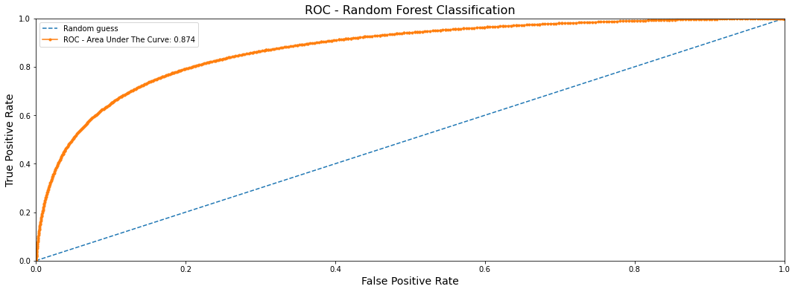

### Key Insights
* The MSD dataset contains important data on the **_meaningful feature variables_** that are critical to determine song_popularity.
* Between the artist and song features, **_artists' (i.e., singers') demography_** tend to have higher influence in determining song_popularity.
* The best accuracy of the machine learning model for the MSD dataset is 80%, which suggests that the dataset needs more data on the current features and additional meaningful features such as the **_artist_location, song_genre, and the revenue related business data_**.      

### Limitations & Future Improvement
* The current analysis lacks data on the artist_location, song_genre, and the revenue related business data. An extension of this analysis with additional data will significantly improve the model accuracy.
* To improve the model accuracy, I tried to run a stacked model with the logistic regression, knn, decision tree, svm, naive bayes, and random forest classifiers. But my machine was not powerful enough to run the stacked model. A simulation with the super computer will significantly improve the model accuracy.
* The interactive app is an initial prototype, which mainly was built using the basic html and css. As future improvement, the goal is to incorporate the advanced frontend tools to make the app more user-friendly.

### Applied Technologies
* Python and Pandas
* Matplotlib and Seaborn
* Postgres Database and SQL-Alchemy
* Scikit-learn and Machine Learning Modeling
* HTML, CSS, and Flask 

